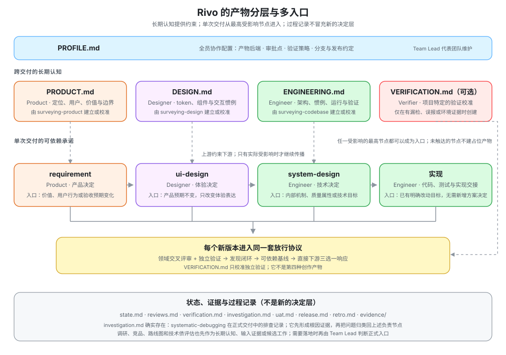
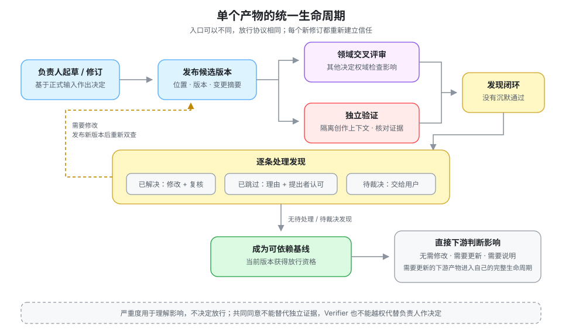

<div align="center">

# rivo

**把一支产研团队装进你的 Agent 宿主**

五个决定权域 · 多入口产物图 · 证据驱动的放行协议

[](LICENSE)
[](https://github.com/reflux-studio/rivo/pulls)


</div>

---

## 不是角色扮演，是交付治理

rivo 是一套**纯文本定义的 AI 软件交付协议**。它把真实产研团队中最难复制的部分——决定权、异议、证据、交接与追责——编码进五个角色、一组方法技能和一份全员共享的协作协议。

它不是让五个 Agent cosplay 人类职位，也不是强迫所有需求依次经过 PRD、设计、技术方案、开发和测试。角色只是相互制衡的逻辑责任；真正的核心是：

> **rivo 把软件交付建模为一张具有决定权、依赖关系和证据门禁的产物图：Agent 可以自主行动，但不能越权，也不能自己证明自己正确。**

单个 Agent 容易同时成为作者、裁判和证人：自己解释需求、自己选择方案、自己实现，再用自己挑选的证据宣布完成。上下文一旦中断，尚未落盘的判断、异议和风险也随之消失。rivo 用六条不可绕过的约束处理这些失败：

1. **一个决定，一个归属。** 任何人都能提案，只有对应负责人能把决定写入正式产物。
2. **从真正受影响的节点进入。** 产品、体验和技术变化可以从不同的正式产物开始；软件异常先调查归类，再进入负责的节点。未被触达的层不生产占位产物。
3. **创作与放行分离。** 领域交叉评审处理专业盲区，未参与创作的 Verifier 独立判断证据是否足够。
4. **异议必须闭环。** 发现不能靠沉默消失，只能被解决、经提出者认可地跳过，或交给用户裁决。
5. **上游变化必须传播。** 直接下游必须明确回应“无需修改 / 需要更新 / 需要说明”，不能默认继续有效。
6. **状态必须可恢复。** 产物和正式记录是正本；聊天与宿主记忆只是缓存。

## 核心模型：一张图，两套规则

rivo 把“工作经过哪些产物”和“一个产物怎样获得信任”分开建模。

### 多入口产物图：决定工作从哪里开始

<p align="center"></p>

入口由这次变化**实际触达的最高决定层**确定。依赖关系是预定义的，但不是每次都走完整条链；如果成员发现入口之上还缺少决定，必须报告路由错误，由 Team Lead 重新判断，不能在自己的辖区里代答。

全仓明确同时进入交叉评审表和 Verifier 验证范围的正式交付产物只有四类：`requirement`、`ui-design`、`system-design` 和实现。它们构成图中的单次交付主干。与之对应的跨交付长期认知是 `PRODUCT.md`、`DESIGN.md`、`ENGINEERING.md`，以及有项目特定验证证据时才创建的 `VERIFICATION.md`；`PROFILE.md` 是全员共享的协作配置。

`state.md`、`reviews.md`、`verification.md`、`investigation.md`、`uat.md`、`release.md`、`retro.md` 和 `evidence/` 负责记录状态、过程与证据，不是新的决定层。调研、竞品、路线图、技术债评估和异常排查等方法输出，也要先成为长期认知、输入证据或候选工作，需要落地时再由 Team Lead 判断正式入口。

| 工作类型 | 前置输入 / 正式入口 | 怎样继续 |
| --- | --- | --- |
| 产品功能 | `requirement` | 只在体验、机制或实现确实受影响时向对应节点传播；有用户可感知结果时组织 UAT |
| 设计系统迭代 | `surveying-design` 先核对事实；结果可更新 `DESIGN.md`，交付工作从 `ui-design` 或更高受影响层进入 | 通知受影响的体验方案和实现；若改变产品语义，报告路由错误并回到 Product |
| 技术债治理 | `tech-debt` 先形成评估；交付工作从明确技术目标、`system-design` 或已有明确目标的实现进入 | Engineer 用可观察成本与风险确定治理目标；只有外显约束变化时才需要 Product / Designer 判断 |
| 软件异常 | `systematic-debugging` 先调查，不预设正式入口 | 正式交付中可记录为 `investigation.md`；取得根因证据后归类到产品、设计、技术、实现、环境或外部依赖 |

这也是为什么 rivo 标准化的是**治理协议**，不是一条万能业务流水线。Product、Designer 和 Engineer 可以在同一阶段共同探索甚至并行评审，但正式决定仍有唯一负责人；方法输出和过程记录也不会因为单独有一个文件名，就自动升级成新的产物层。

### 产物生命周期：决定一个版本何时可信

<p align="center"></p>

无论入口是什么，每个需要放行的新版本都服从同一套生命周期：

1. 负责人依据正式输入起草或更新产物，并标明当前版本；
2. 相关领域负责人做交叉评审，Verifier 在独立上下文中核对关键声明和证据；
3. 作者逐条回应发现；提出者负责复核，分歧由 Team Lead 收口给用户；
4. 没有待处理或待裁决发现后，当前版本才成为可依赖基线；
5. 基线变化通知直接下游；需要更新的下游产物重新走自己的完整生命周期。

宿主支持并行时，互不依赖的评审、验证和下游响应可以并行；存在真实依赖时仍按依赖等待。rivo 固定的是责任、输入、退出条件和回流规则，不规定某个宿主必须怎样调度。

## 五个角色，分离六类权力

<p align="center"></p>

| 决定 | 归属 |
| --- | --- |
| 价值取舍、最终验收、不可逆操作的批准 | 用户 |
| 问题定义、范围与验收标准 | Product |
| 交互语义与体验表达 | Designer |
| 技术方案、实现与发布执行 | Engineer |
| 证据是否足以放行 | Verifier |
| 入口判断、调度与交付状态 | Team Lead |

角色是**逻辑责任**，不是人数或职业头衔。一个人或 Agent 可以同时承担多个领域角色，但作决定时必须明确自己戴的是哪顶帽子；Verifier 至少需要与作者隔离的独立上下文，不能由同一个创作过程顺手“自检通过”。企业已有 PM、设计师或架构师对外部正式产物负责时，他们就是该层负责人，rivo 不夺走所有权，也不复制一份内部版本。

每个角色带着自己的方法技能上场：

| 角色 | 方法技能 |
| --- | --- |
| **Team Lead** | `onboarding` 入场 · `coordinating` 组织交付 · `organizing-retro` 复盘 |
| **Product** | `writing-requirements` · `running-uat` · `surveying-product` · `competitive-brief` · `roadmap-update` |
| **Designer** | `writing-ui-design` · `surveying-design` |
| **Engineer** | `writing-system-design` · `implementing-changes` · `test-driven-development` · `systematic-debugging` · `shipping` · `surveying-codebase` · `tech-debt` |
| **Verifier** | `verifying` |
| **全员共享** | `collaborating` 协作协议 · `brainstorming` 脑暴 · `frontier-questioning` 前沿提问 |

## 为什么“交叉评审”和“独立验证”都需要

两者处理的不是同一种错误。

**交叉评审**让持有其他决定权的人检查当前产物对自己辖区的影响。例如：

- Designer 评 requirement：产品决定是否足以定义正确体验；
- Engineer 评 requirement / ui-design：成本、可行性和架构风险是否已被看见；
- Product 评 ui-design / 外显实现：结果是否仍忠于用户价值。

**独立验证**处理创作者偏见和错误共识。Verifier 不拥有产品、设计或技术决定权，也不接收作者未落盘的创作过程；它只依据当前版本、正式上游、项目认知和实际证据回答：关键声明是否成立，这个版本是否足以继续。

三个创作者一致同意，不能替代独立证据；Verifier 的反对也不能越权替负责人重写决定。它提出发现，负责人回应，提出者复核，必要时由用户裁决。

## 发现闭环：允许不同意，不允许假装没看见

每条评审或验证发现都记录位置、严重度、影响和建议动作。严重度只描述影响，用于排序；它不直接决定能否放行。每条发现只有三条出路：

- **已解决**：作者修改，提出者复核后确认问题消失；
- **已跳过**：作者说明理由，提出者认可，并记录重新打开条件；
- **待裁决**：提出者不接受理由，不再无限争论，由 Team Lead 交用户决定。

只要仍有待处理或待裁决发现，当前版本就不能放行。这样既不会让“轻微”成为绕过流程的标签，也不会逼团队把每个建议都实现。

## 产物不是文档，是可依赖的承诺

`requirement`、`ui-design`、`system-design` 和实现可以是文件、工单、设计稿、代码提交或宿主对象。格式不是重点；重点是它有明确负责人、可直接定位的事实源、可核对的版本，以及足够让下游不再猜测的决定。

上一层产物是下一层的验收依据。上游发布新修订后，每个直接下游必须选择：

- **无需修改**：当前产物仍然有效，并说明理由；
- **需要更新**：发布新修订，并重新评审与验证；
- **需要上游说明**：信息不足，提出明确问题。

这是一套显式的失效传播机制：没有“文档改了，但代码大概还能用”的沉默区。

## `.rivo`：可接管的外部状态

没有指定外部系统时，正式产物与记录落在项目仓库的 `.rivo/`。大写文件是跨交付的长期认知，小写目录是单次交付现场：

```text
.rivo/
├── PRODUCT.md          # 产品认知，Product 持有
├── DESIGN.md           # 设计认知与设计系统，Designer 持有
├── ENGINEERING.md      # 工程认知，Engineer 持有
├── VERIFICATION.md     # 可选；项目特定的验证校准知识
├── PROFILE.md          # 协作配置，全员共同约定
├── issues/<slug>/      # 进行中的交付
│   ├── state.md            # 当前状态、下一步、产物位置、版本与未关闭发现
│   ├── requirement.md      # ↓ 按实际触达创建，不占位
│   ├── ui-design.md
│   ├── system-design.md
│   ├── implementation.md
│   ├── investigation.md    # 异常排查过程记录，不是新的决定层
│   ├── reviews.md          # 交叉评审、作者回应、跳过理由、用户裁决
│   ├── verification.md     # 独立验证结论与证据
│   └── evidence/           # 截图、录屏、日志等
└── archived/<slug>/    # 交付完结后归档
```

`state.md` 是可恢复的现场：会话中断后，任何成员读它就能接手，不依赖聊天记忆。已经使用工单、在线文档或设计平台时，以外部系统为事实源，`.rivo` 只记录可达位置；一份产物始终只有一个正本。

## 如何接入

rivo 不绑定特定 Agent 平台，也不提供一个假装适配所有宿主的安装命令。接入只需要宿主能够加载角色定义、技能，并为需要的角色提供独立上下文：

1. 将 `roles/` 中的 `agent.md` 和角色技能映射到宿主的 Agent / Skill 机制；
2. 将 `skills/` 中的共享技能提供给全员；
3. 让 Team Lead 运行 `onboarding`，与用户确认产物后端、审批点、验证独立性和项目惯例；
4. 正式交付由 `coordinating` 建立可恢复状态并判断入口；临时探索可直接与任一角色自由协作。

自由协作的产出默认是草稿：可以就地结束、转成正式交付，或经对应负责人采纳后沉淀进长期认知。没有进入正式协议的聊天不会自动成为事实。

## 仓库结构

```text
rivo/
├── roles/                      # 五个角色：agent.md + 角色方法技能
│   ├── team-lead/
│   ├── product/
│   ├── designer/
│   ├── engineer/
│   └── verifier/
└── skills/                     # 全员共享技能
    ├── collaborating/          # 决定权、入口、放行、留痕与变更传播
    ├── brainstorming/          # 产生真正不同的候选方向和取舍
    └── frontier-questioning/   # 沿决策依赖提问，暴露默默假设
```

技能内的 `references/` 存放按需加载的结构模板、检查清单和证据方法，主文件只保留工作规则。

## 常见问题

**是不是所有工作都要从 Product 开始？**

不是。改变产品价值或用户行为时才从 `requirement` 进入；纯体验或技术工作可以从对应的正式节点进入。软件异常不是一个与它们平级的新层，而是先通过 `systematic-debugging` 调查归类，再回到真正负责的节点。成员如果发现遗漏了更高层决定，会报告路由错误，而不是自行补写一份伪需求。

**`investigation.md` 到底是不是产物图节点？**

它确实存在，但不是核心决定层。`systematic-debugging` 在正式交付中把复现、根因、假设和修复证据写入 `investigation.md`；它是过程与证据记录。调查完成后，问题仍要归类到 requirement、ui-design、system-design、实现、环境或外部依赖。

**是不是每次都要生成 requirement、ui-design、system-design？**

不是。固定的是被触达产物的负责人、评审者、证据和退出条件，不是文件数量。小改动可以很短，没有影响的层不建占位文件，但“无影响”需要由对应负责人基于事实作出判断。

**为什么不让多个 Agent 直接共同写一份结论？**

共同探索和并行评审没有问题，Product Trio 也可以用于形成 requirement；但正式决定仍要有唯一负责人，最终证据判断仍要与创作隔离。共享上下文能降低返工，也会放大共同盲区，不能替代独立验证。

**为什么不建统一的产物 ID 和版本系统？**

文件路径、文档链接、设计稿或宿主对象已经能定位产物，版本沿用 commit、文档版本等现有标记。再建一层注册表会产生第二个可能失同步的正本。

**五个角色必须都由 AI 承担吗？**

不必须。角色是逻辑责任；人类 PM、设计师、工程师或外部团队都可以持有对应产物。只要决定权、事实源、评审与放行关系清楚，协议仍然成立。

## 贡献

欢迎 Issue 和 PR——尤其是真实使用中发现的协议漏洞：哪个决定权仍能被越过、哪条发现可以被静默忽略、哪种工作无法从现有入口正确路由。

## License

[MIT](LICENSE) © Reflux Studio
