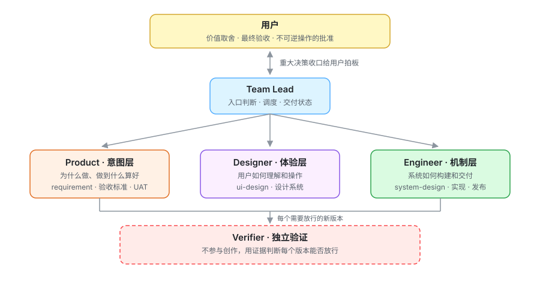
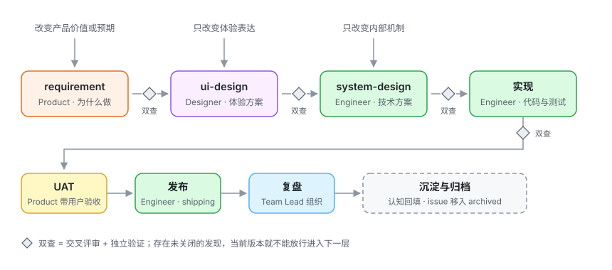

<div align="center">

# rivo

**把一支产研团队装进你的 Agent 宿主**

五个角色 · 一份协作协议 · 全程留痕的交付流程

[](LICENSE)
[](https://github.com/reflux-studio/rivo/pulls)


</div>

---

## rivo 是什么

rivo 是一套**纯文本定义的多 Agent 产研团队**:五个角色、每个角色自己的方法技能,外加一份约束全员的协作协议。它不写代码、不依赖特定平台——角色是 Markdown 定义,技能是标准的 `SKILL.md`,接到任何支持多 Agent 与技能机制的宿主上都能工作。

它想解决的问题很具体:单个 Agent 既当裁判又当运动员——自己写需求、自己实现、自己说"测试通过了"。rivo 把这件事拆开:**写的人不放行,放行靠证据,证据要留痕**。

三条设计红线贯穿所有文件:

- **宿主无关**——协议只规定角色责任和放行规则,调度方式服从宿主能力,角色责任不随宿主改变;
- **验证平级不降级**——Verifier 是与创作者平级的独立角色,不是创作流程里的一个步骤;
- **一切留痕**——评审发现、跳过理由、用户裁决都落在正式载体上,可供复盘追溯;文件是正本,记忆只是缓存。

## 角色与决定权

<p align="center"></p>

每个决定只有一个归属,对他人辖区只有提案权;重大决策(架构方向、生产发布、回滚、删数据等不可逆动作)必须先经用户批准。

| 决定 | 归属 |
| --- | --- |
| 价值取舍、最终验收、不可逆操作的批准 | 用户 |
| 问题定义、范围与验收标准 | Product |
| 交互语义与体验表达 | Designer |
| 技术方案、实现与发布执行 | Engineer |
| 证据是否足以放行 | Verifier |
| 入口判断、调度与交付状态 | Team Lead |

每个角色带着自己的方法技能上场:

| 角色 | 方法技能 |
| --- | --- |
| **Team Lead** | `onboarding` 入场 · `coordinating` 组织交付 · `organizing-retro` 复盘 |
| **Product** | `writing-requirements` · `running-uat` · `surveying-product` · `competitive-brief` · `roadmap-update` |
| **Designer** | `writing-ui-design` · `surveying-design` |
| **Engineer** | `writing-system-design` · `implementing-changes` · `test-driven-development` · `systematic-debugging` · `shipping` · `surveying-codebase` · `tech-debt` |
| **Verifier** | `verifying` |
| **全员共享** | `collaborating` 协作协议 · `brainstorming` 脑暴 · `frontier-questioning` 前沿提问 |

## 一次完整交付如何推进

<p align="center"></p>

**入口由工作触达的最高抽象层决定。** 改变产品价值从 requirement 进入;产品预期已定、只改体验从 ui-design 进入;只改内部机制从 system-design 进入。上一层的方案就是下一层的验收依据,未被触达的层不生产占位产物。观察到软件行为异常时不预设归属,由 Engineer 先用 `systematic-debugging` 调查,再归类到该负责的层去修。

**放行靠双查。** 每个新版本要过两道独立的关:

1. **交叉评审**——持有不同领域判断权的成员检查这份产物对自己辖区的影响(例如 requirement 由 Designer 和 Engineer 评"体验是否可定义、技术代价是否可行");
2. **独立验证**——交给没有参与创作的 Verifier,用审阅、构建、测试、UI 走查或隔离实验形成结论,注明实际验证的版本和证据。

**发现必须闭环。** 每条发现只有三条路:**已解决**(改完并经提出者复核)、**已跳过**(说明理由并经提出者认可,记录重新打开的条件)、**待裁决**(双方不再拉扯,由 Team Lead 收口给用户)。只要还有一条发现未关闭,当前版本就不能放行——严重度只用来排序和理解风险,**不决定放行**。

**变更向下传播。** 上游发布新修订后,每个直接下游必须三选一明确回复:无需修改(说明理由)、需要更新(发布新修订)、需要上游说明(提出明确问题)。沉默不是选项。

不想走完整流程时也可以**自由协作**:直接找任何角色对话,产出默认是草稿——就地结束、转成正式需求、或沉淀进长期认知,三选一。

## 一切留痕:`.rivo` 工作区

没有指定外部系统(工单、在线文档)时,所有产物落在项目仓库的 `.rivo/` 目录,随仓库提交。大写文件是跨交付的长期认知,小写目录是单次交付:

```text
.rivo/
├── PRODUCT.md          # 产品认知,Product 持有
├── DESIGN.md           # 设计认知(设计系统),Designer 持有
├── ENGINEERING.md      # 工程认知,Engineer 持有
├── VERIFICATION.md     # 验证校准知识,Verifier 按需创建
├── PROFILE.md          # 协作配置,全员共同约定
├── issues/<slug>/      # 进行中的交付
│   ├── state.md            # 当前状态、下一步、产物位置、未关闭发现
│   ├── requirement.md      # ↓ 各层产物与记录,按需创建,不占位
│   ├── ui-design.md
│   ├── system-design.md
│   ├── implementation.md
│   ├── reviews.md          # 交叉评审、作者回应、跳过理由、用户裁决
│   ├── verification.md     # 各版本的独立验证结论和证据
│   └── evidence/           # 截图、录屏、日志
└── archived/<slug>/    # 交付完结后整个目录移入
```

`state.md` 是可恢复的现场:会话中断后,任何成员读它就能接手,不依赖聊天记忆。协作配置为某类产物指定了外部系统时,以外部系统为事实源,`.rivo` 不放副本——一份产物只有一个正本。

## 仓库结构

```text
rivo/
├── roles/                      # 五个角色,每个 = agent.md(角色定义)+ skills/(方法技能)
│   ├── team-lead/
│   ├── product/
│   ├── designer/
│   ├── engineer/
│   └── verifier/
└── skills/                     # 全员共享技能
    ├── collaborating/          # 协作协议:决定权、放行、留痕、变更回流
    ├── brainstorming/          # 发散出真正不同的候选方向和取舍
    └── frontier-questioning/   # 按设计树分轮提问,直到没有默默假设
```

技能内的 `references/` 存放按需加载的深度材料(文档结构模板、检查清单、示例),主文件保持精简。

## 设计理念问答

**已经有交叉评审了,为什么还要一个独立的 Verifier?**
两者回答的问题不同。交叉评审是领域负责人检查产物对自己辖区的影响——Designer 评 requirement 问的是"这能定义出正确的体验吗"。Verifier 回答的是"这个版本的关键声明有证据支撑吗",而且它只接收产物、上游依据和项目认知,不接收作者的创作过程——不被"作者觉得没问题"污染,是独立验证的前提。

**为什么严重度不决定放行?**
"轻微问题可以直接过"意味着有人可以通过把问题标成轻微来绕过流程。rivo 把两件事分开:严重度描述影响,用于排序;放行只看每条发现是否走完闭环——解决、经认可地跳过、或交用户裁决。跳过是允许的,但要留下理由、认可者和重新打开的条件。

**rivo 绑定哪个 Agent 平台?**
不绑定。角色和技能都是纯文本,协议只规定"谁对什么负责、什么条件下放行",调度方式(并行、串行、子 Agent)服从宿主能力。换宿主,角色责任不变。

**五个角色必须都由 AI 承担吗?**
不必须。角色是逻辑责任。企业里已有 PM、设计师或架构师对正式产物负责时,他们就是该层负责人——rivo 不为了统一格式夺走所有权,也不复制一份内部副本。

**为什么不建统一的产物 ID 和版本系统?**
每个产物都能通过文件路径、文档链接或宿主对象直接定位,版本用后端已有的标记(commit、文档版本)。再造一层注册表意味着多一个要维护、会失同步的正本——rivo 的原则是一份产物只有一个事实源。

**`.rivo` 会不会把我的仓库弄乱?**
不发生的阶段不创建占位文件,交付完结后整个 issue 目录移入 `archived/`。已在用工单系统或在线文档的团队,可以在协作配置里把产物指到外部系统,`.rivo` 里就只剩指向事实源的链接。

## 贡献

欢迎 Issue 和 PR——尤其是真实使用中发现的协议漏洞:哪个环节可以被绕过、哪条规则在实践中形同虚设。

## License

[MIT](LICENSE) © Reflux Studio
