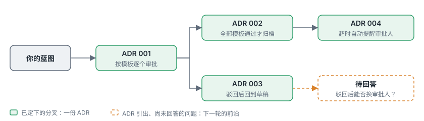

<h1 align="center">Rivo</h1>

<p align="center"><b>方案由你主导，AI 负责查证、追问和落实。</b><br>一套面向 Claude Code 与 Codex 的软件交付技能。</p>

<p align="center">
  
  
  
</p>

---

把方案设计整个交给 AI，代码通常能跑，但团队里没人说得清它为什么这样设计。下一次改动时，没人知道哪些约束碰不得，这就是**认知债务**。

Rivo 的做法是反过来：你带着脑中的方案蓝图开始，AI 查证前提、追问缺口、补全细节；每个重要的判断都由你做出，并当场留下记录。方案写成同事读得懂的文档，实施被当作对方案的验证，交付完成后，这次得到的认识沉淀进项目知识库。


## 设计原则

**人做决定。** AI 的建议在你回答之前只是建议。沉默、跳过或关闭提问都不算同意；批准方案也不等于授权实施。

**决策树即 ADR。** 讨论按决策树逐轮推进，每个定下的分叉当场写成一份 ADR。ADR 里的"引出的问题"就是下一轮要问的内容，`adr/` 目录本身就是这棵树，不需要另外维护讨论记录。



**实施即验证。** 方案对不对，要照着做了才知道。task.md 只写到"交付什么、守住哪些契约"，不写到文件级；执行者带着质疑去做，发现方案走不通就停下报告，而不是绕过去硬做。

**审阅要花在刀刃上。** 方向错误在第一轮审阅就会暴露，所以方案只在定稿前全量审一次；实施逐任务轻审，完成后再整体审一次。意见分 P0 到 P2，没有 P0 即通过，允许带着小瑕疵上线。修复交回同一个审阅者增量复核，不每轮从头再来。

**写给人读。** 方案和知识库用连贯的段落讲清前因后果，配 before/after 图对照变化。这套写法同样用于技能文本本身：模型从人类文字中学会阅读，写不清楚的东西它也会读错。

## 开始使用

安装插件后，直接描述要做的事：

> 用 Rivo 完成这个需求。我打算沿用现有审批链，增加供应商发起入口。先查清现状，再和我逐轮讨论。

也可以点名某个技能：

> 用 writing-plans 根据团队评审意见修订这份技术方案。
>
> 我验收通过了，用 knowledge-management 收尾。
>
> 用 investigating 查清 OA 怎样读取数组字段。

是否走 Rivo 由你决定。小改动直接做就好；遇到明显较大的需求，AI 会先建议，你同意后才进入流程。

## 一次交付

| 阶段 | 技能 | 产出 | 你在这里做什么 |
| --- | --- | --- | --- |
| 讨论 | converging | `adr/`、`note.md`、before 图 | 给出蓝图，逐轮回答问题 |
| 方案 | writing-plans | `plan.md` | 自审或拉团队评审，批准定稿 |
| 实施 | implementing-plans | `task.md`、代码、审阅报告 | 授权实施，处理方案偏离，验收 |
| 知识 | knowledge-management | 更新后的项目知识库 | 无需操作 |

**讨论。** AI 先读需求、项目知识库和团队规约，确认你的思路，画出现状的 before 图，和你对齐"现在是什么样"。之后每轮最多问 5 个问题，每个问题附场景、依据和建议答案；能查到的事实 AI 自己查，只把决定交给你。没有未决的分叉、主要场景和失败场景都走得通、你确认双方理解一致，讨论才结束。

**方案。** AI 把讨论写成 `plan.md`：需求与范围、现状与总体方案、按主题展开的设计、影响面、验证与发布。独立审阅通过后交给你，批准即定稿 v1.0。之后每次修改都升版本，并告诉你改了什么、为什么。

**实施。** 你授权后，AI 写一份粗粒度的 `task.md`，逐任务派执行者实施、派审阅者轻审。实现和方案不一致时分三种处理：推翻了某份 ADR，回到讨论由你决定；改变了方案写明的内容，修订 plan.md 请你确认；方案没写到的实现选择，AI 决定并记录。全部完成后整体审阅，再请你验收。

**知识。** 你明确验收后，AI 对照最新代码，把本次的认识写进项目知识库：只改涉及的主题，写成新同事能从首页读懂的文字。需求目录随后归档。

## 文件位置

```text
.rivo/
  issues/<需求>/
    adr/          决策树的每个分叉
    plan.md       技术方案
    task.md       实施方案与实施记录
    note.md       按主题组织的调查笔记
    assets/       图与图源
    reviews/      审阅报告
    evidence/     验证证据
  knowledge/      项目知识库
  archived/       验收后归档的需求
```

用户或项目指定的位置优先。Rivo 不维护状态文件，继续工作时从这些材料和实际改动中核对进度，所以随时可以接着上次的需求目录往下做。

## 技能

| 技能 | 用途 |
| --- | --- |
| [using-rivo](skills/using-rivo/SKILL.md) | 入口：什么时候走 Rivo、交付顺序与宿主调用 |
| [converging](skills/converging/SKILL.md) | 讨论需求与方案，边问边记 ADR |
| [writing-plans](skills/writing-plans/SKILL.md) | 编写、审阅和修订技术方案 |
| [implementing-plans](skills/implementing-plans/SKILL.md) | 编排实施、审阅与验收 |
| [knowledge-management](skills/knowledge-management/SKILL.md) | 维护项目知识库，查阅项目知识 |
| [investigating](skills/investigating/SKILL.md) | 查清具体问题，维护调查笔记 |
| [writing-clearly](skills/writing-clearly/SKILL.md) | 写清楚文档、图和提示词，去掉 AI 腔 |
| [test-driven-development](skills/test-driven-development/SKILL.md) | 用失败测试驱动行为实现 |
| [systematic-debugging](skills/systematic-debugging/SKILL.md) | 复现异常并验证根因 |

画图优先用 [Archify](https://github.com/tt-a1i/archify)，没有时按 writing-clearly 的模板手写 SVG。本页的两张图分别用这两种方式画成，图源在 [docs/assets](docs/assets)。

## 接入

| 宿主 | 插件清单 |
| --- | --- |
| Claude Code | [.claude-plugin/plugin.json](.claude-plugin/plugin.json)、[marketplace.json](.claude-plugin/marketplace.json) |
| Codex | [.codex-plugin/plugin.json](.codex-plugin/plugin.json) |

在 Claude Code 中，[启动 Hook](hooks/hooks.json) 只在含 `.rivo/` 的项目里注入完整入口，其他项目只注入一行提示。子代理用什么模型由宿主配置决定，Rivo 不指定。

## 修改 Rivo

修改技能时按 writing-clearly 写，同步检查参考文件、审阅提示词、插件清单、hook 和本 README。格式检查通过不代表实际好用，改完要在真实需求上试用。

## 许可证

[MIT](LICENSE)

writing-clearly 的写法部分改编自 Strunk 的 *The Elements of Style*（公有领域）与 [writing-clearly-and-concisely](https://github.com/softaworks/agent-toolkit)（MIT），AI 腔清单改编自 [humanizer](https://github.com/blader/humanizer)（MIT）。
