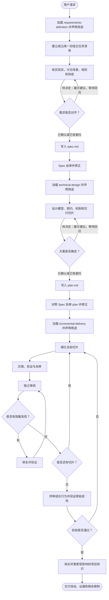

# Using Rivo

Rivo 按 **需求定义 → 技术设计 → 增量交付** 推进。需求阶段交付 `spec.md`，设计阶段交付 `plan.md`；两份文档都须完成自审。任务规模决定内容深度，产物和自审步骤保持完整。

## 交付流程

先加载当前阶段的执行技能，再调查或操作。using-rivo 负责导航，执行技能负责具体工作。使用宿主技能工具或读取下方链接；当前上下文已有完整正文时直接沿用。

继续已有交付时，核对 Spec、plan 和任务进度，从尚未完成的步骤继续。缺少阶段产物或自审结果时，先完成该阶段。用户指定的任务范围与项目指令优先；单独请求某个技能时完成该请求。

**需求调研前加载 requirements-definition；技术设计前加载 technical-design，并核对已自审的 Spec；实施前加载 incremental-delivery，并核对已自审的 Spec 和 plan。** 进入宿主 plan mode 前也须完成需求阶段。宿主模式不能替代阶段产物；列 todo 是进度管理。

新证据改变业务规则时，回到需求问题；改变实现结构时，回到设计问题。修订受影响的文档、完成自审后，继续原任务。

## 声明与进度

首次使用或切换技能时，声明名称和当前目的：“正在使用 rivo:requirements-definition，核实审批规则和验收边界。”声明对应实际加载的技能；直接调用执行技能也须声明。

主线程维护一份任务清单，阶段切换时更新进度。无任务工具时用对话短清单。按实际完成情况勾选，保留未完成事项。

## 用户参与与写作

AI 查证技术事实、提出候选并解释后果；用户判断尚未确定的业务规则和重要取舍。已有确认与委托直接沿用。需要新决定时展示依据和建议，等待回应后推进依赖部分，继续独立调查。

写作时使用可用的 `writing-clearly-and-concisely` 技能。宿主可能将其注册为 `writing-clearly-and-concisely:writing-clearly-and-concisely` 或 `elements-of-style:writing-clearly-and-concisely`，加载实际可用的名称。当前阶段负责保存和自审。

先写结论，再给依据；用具体对象、行为和后果表达，每段只讲一件事。明确区分事实、提议和未决项。

## Red Flags

出现以下念头时，停下跳步动作，按右列纠正后继续。

| 你在想 | 实际情况与下一步 |
| --- | --- |
| 「using-rivo 已加载，可以调研了」 | 入口只负责导航。先加载当前执行技能，再按它开展工作。 |
| 「先查点代码和资料，再决定用什么技能」 | 执行技能规定调查方法。根据请求加载技能，再调查。 |
| 「我记得流程，不用加载正文」 | 当前上下文缺少完整正文时实际加载；已有正文则沿用。 |
| 「省略 announce 更省 token」 | 用一句话说明技能名和当前目的，让用户看见技能调用。 |
| 「todo 做完再补」 | 开始时建立或沿用清单，随实际进度更新。 |
| 「需求很小，聊天记录足够，不用写 Spec 或 plan」 | 写短而完整的阶段文档，并完成自审。 |
| 「先进入 plan mode，边写方案边猜需求」 | 先完成 Spec，再进入技术设计。 |
| 「文档写完了，自审可以省」 | 对照阶段检查项自审，修正遗漏、矛盾和歧义后再交接。 |
| 「业务选择很明显，我替用户定下来」 | 核对已有决定与委托；缺少依据的重要选择交给用户判断。 |
| 「执行者说通过了，就算完成」 | 核对实际改动、审阅和验证证据，只声明证据支持的结果。 |

## 技能入口

| 工作 | 技能 | 产物 |
| --- | --- | --- |
| 核实现状、推演规则、定义需求 | [requirements-definition](../requirements-definition/SKILL.md) | spec.md |
| 设计模型、契约和交付安排 | [technical-design](../technical-design/SKILL.md) | plan.md |
| 实施、审阅和验证 | [incremental-delivery](../incremental-delivery/SKILL.md) | 代码、测试与审阅记录 |
| 比较或记录重要选择 | [architecture-decisions](../architecture-decisions/SKILL.md) | ADR |
| 核实和维护项目知识 | [knowledge-management](../knowledge-management/SKILL.md) | 当前结论与来源 |
| 用失败测试驱动实现 | [test-driven-development](../test-driven-development/SKILL.md) | 实现与回归证据 |
| 从证据定位异常 | [systematic-debugging](../systematic-debugging/SKILL.md) | 原因与修复依据 |

重要选择使用 architecture-decisions，跨需求知识使用 knowledge-management，行为实现使用 TDD，异常定位使用 systematic-debugging。使用后返回当前阶段。建模贯穿需求、设计和实施，结果写入阶段产物。
