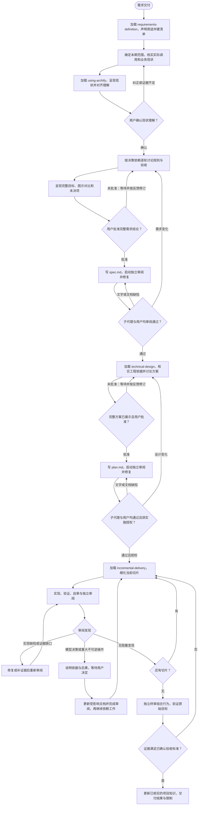

# Rivo 使用指南

先加载相关技能，再回应或行动。流程技能决定工作方式，必须先于实施技能加载。本入口不代替执行技能。

用户和项目指令优先。用户指定只评审、排障或记录决定时，完成该项工作；完整需求交付按需求定义、技术设计、增量交付推进。已经选择完整交付，就不能以任务小为由省略 Spec、plan 或审阅。

## 开始工作

1. 识别用户本次要完成的范围。分期需求先处理指定的一期，后续需求作为约束，不提前设计和实施。
2. 加载当前执行技能。开发需求先用 requirements-definition；展开已批准的 Spec 用 technical-design；按已批准方案实施用 incremental-delivery。排障、测试、决策记录和知识维护使用对应技能。
3. 声明技能名称和用途，例如：“正在使用 rivo:requirements-definition，核实现状并讨论本期需求。”只有实际加载后才能这样声明。
4. 把技能的工作步骤加入宿主任务清单，按顺序完成。已有清单直接沿用，只有完成条件成立才能勾选。

首次使用或切换技能时声明一次，同一阶段无需反复声明。当前上下文已有完整技能正文时沿用；记得技能名字或读过旧版本不等于已经加载。

## 宿主工具

先查看当前环境的技能列表和可用工具。工具名称可能变化，以当前工具说明为准。

| 动作 | Claude Code | Codex |
| --- | --- | --- |
| 加载技能 | 使用 Skill 加载技能列表中的名称，包括插件前缀 | 按技能目录读取 SKILL.md；环境提供技能加载工具时使用该工具 |
| 管理进度 | 使用 TaskCreate / TaskUpdate；工具延迟加载时先通过工具发现入口取得 | 使用当前提供的计划或任务工具；没有此类工具时在会话中维护短清单 |
| 收集决定 | 使用 AskUserQuestion，先说明场景、依据与建议 | 使用当前可用的用户提问工具，遵守它的模式限制；没有适用工具时在会话中提问 |
| 独立审阅 | 用当前 Agent / 子代理工具启动审阅者 | 用当前 spawn_agent 等子代理工具启动审阅者 |

其他宿主按相同动作匹配其原生能力。有任务工具就使用工具，文字清单只在没有此类工具时使用。技能通过技能目录发现，工具通过工具发现入口查找；工具搜索没有结果，不能证明某个技能未安装。

用户关闭提问、没有作答或保持沉默，都不是决定。保留问题，等待明确回答；继续处理不依赖该决定的工作。不要替用户解释为什么关闭了问题，也不要把这种解释写成用户偏好。

## 阶段门禁

**展示并取得批准后才能写入阶段文档；文档通过独立审阅和用户审阅后才能进入下一阶段。** 写入前批准结论，写入后检查文档是否忠实表达结论。用户明确要求整理已确认内容时，沿用该批准，不重复索取。

需求结论写入 `spec.md`，技术方案写入 `plan.md`。开始技术设计前核实 Spec 的审阅结果；开始实施前核实两份文档的审阅结果和实施授权。进入宿主的计划模式前先完成需求阶段，计划模式不代替阶段文档。

## 交付流程

用户判断节点必须等待回应，不能由 AI 自行通过。最终验证由 AI 对照已确认标准提供证据；约定需要用户验收的事项，等待用户验收。

恢复任务时读取 Spec、plan、`reviews/` 和实际改动，用户决定从会话核对。文件存在不等于审阅通过，旧报告不自动覆盖新改动。缺失的批准不能凭推测补齐。无需另建状态文件或批准台账。

## 审阅与分歧

每轮启动新的独立审阅者，提供当前文件、原始依据、用户决定和前轮报告。审阅者自己读取材料，报告写入本需求的 `reviews/`，说明被审版本、发现和证据。主代理修复后再交新的审阅者复审。

涉及模型决策或重大不可逆操作，说明选择、依据和后果，等待用户确认。已有明确批准继续沿用；普通实现缺陷按已确认规则修复。规则或重要方案改变后，更新相关文档并重新完成独立审阅和用户审阅，再继续依赖它的工作。

同一问题反复出现且没有新证据时，停止重复复审。技术事实继续查证，模型分歧交给用户决定；不要靠增加轮次碰运气。

## 文档与图示

Spec、plan、ADR 使用 Markdown。写作前加载可用的 writing-clearly-and-concisely 技能。按读者理解问题的顺序展开：具体场景、规则或设计、理由、后果。正文必须保留完整技术含义，即使不看图也能据此设计或实施。

解释实体关系、系统协作、流程或状态时，加载 using-archify，在讨论该问题时绘图并展示，随后把 SVG 嵌入对应正文。图不能等方案写完才补。重要的职责、接口、数据或生命周期选择，加载 architecture-decisions，独立记录 ADR；正文仍要讲清选择及主要理由。

链接用于追溯证据和深入阅读，不能代替解释。当前章节应说清当前问题，必要时简短重述共同约定；不要用“见上文”“同另一文档”串起整篇方案。不要把文档压缩成只有编号、术语和路径的索引。

## 常见错误（Red Flags）

| 你在想 | 必须改做什么 |
| --- | --- |
| “入口加载了，可以直接调查” | 先加载当前执行技能。 |
| “先做点事，清单和声明最后补” | 先声明用途、建立清单，再按步骤执行。 |
| “顺便把下一期也设计了” | 回到用户指定范围，后续需求只作为约束。 |
| “我读懂了，现状对齐已完成” | 展示查证后的现状，等待用户确认或纠正。 |
| “类型和接口都存在，说明已经接入” | 查实际调用方和配置，按证据描述接入情况。 |
| “用户答过一轮，可以写文档了” | 解决相关分支，展示完整结论并取得批准。 |
| “问题被关闭，应该就是默认同意” | 保留未决问题，不推断用户意图。 |
| “核心问题列为待办，就能定稿” | 解决该问题或请用户调整范围，再完成阶段。 |
| “有图、有标题，文档就完整了” | 检查规则、契约和机制是否足以支持下一阶段。 |
| “我自审过，不用再派审阅者” | 启动独立子代理检查真实文件和依据。 |
| “原方案已批准，这次改动也算批准” | 对改变的规则或重要选择重新取得决定。 |
