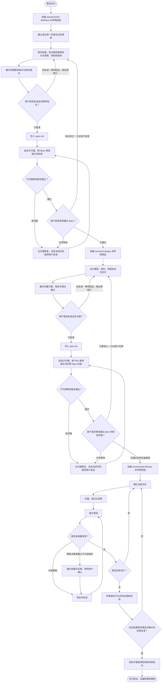

# Rivo 使用指南

## 先选择技能

回应或行动前，先检查是否有相关或用户指定的技能，加载后再开始提问、调查或修改。流程技能先于实施技能，它决定后续怎么做。

- 开发需求或功能：先用 requirements-definition，再进入技术设计和增量交付。
- 排查异常：先用 systematic-debugging，再按原因处理。
- 查找项目知识、比较架构选择：使用对应技能。

选用技能后，说明名称和用途，并按它的步骤建立任务清单。用户和项目指令优先；指定单项工作时，完成该项即可。

## 完整交付

需求交付按 **需求定义 → 技术设计 → 增量交付** 推进。需求写入 `spec.md`，方案写入 `plan.md`。

两份文档都要先向用户展示完整结论，获批后再写入。然后请子代理审阅，修复问题，再交给用户审阅。写入前确认结论，写入后检查文档是否准确表达了结论。用户通过后才能进入下一阶段。任务小就写短，文档和审阅步骤仍要完成。

## 交付流程

先加载当前阶段的执行技能，再开始调查或操作。本技能只说明顺序，具体做法在下方的技能中。用当前环境的技能工具加载，或直接读取链接中的文件；当前上下文已有完整正文时，不必重复读取。

图中要求“等待回应”的地方，必须等用户回复，才能修改或继续，不能由 AI 自行判断通过。

继续已有任务时，读取 Spec、plan、`reviews/` 和实际改动，判断已经完成什么、下一步做什么。用户意见从会话中核对。

开始各阶段前，检查以下事项：

- **需求调研：** 加载 requirements-definition。
- **技术设计：** 加载 technical-design，确认 Spec 已通过子代理和用户审阅。
- **实施：** 加载 incremental-delivery，确认两份文档的审阅结果，以及用户的实施授权。

进入当前工具的计划模式前，也要完成需求阶段。计划模式不能代替阶段文档，任务清单只用于记录进度。

新证据改变业务规则时，回到需求讨论；改变重要设计选择时，回到方案讨论。说明变了什么、会有什么影响，取得批准后修改文档，再完成子代理和用户审阅。

## 声明与进度

首次使用或切换技能时，用一句话说明名称和用途，例如：“正在使用 rivo:requirements-definition，核实审批规则和验收要求。”只有实际加载后才能这样说明，直接调用执行技能时也一样。

主代理维护一份任务清单，在阶段切换时更新。没有任务工具就在对话中列短清单。完成一项再勾选，未完成的保留。

## 与用户讨论

按问题之间的依赖逐轮讨论，具体方法见[决策树协作](../requirements-definition/SKILL.md#决策树协作)。AI 查证事实，用场景比较方案并给出建议，用户作出决定。收到回答后，更新模型和问题，再讨论需要这些答案的下一轮。

用户批准的是实际看过并确认的内容。回答一个范围问题，只确认了那个问题；“帮我梳理”或“用 Rivo 完成”不代表批准了尚未展示的结论。

已有明确批准继续沿用，沉默或没有提出异议不算批准。子代理负责检查文档质量，是否接受仍由用户决定。

## 审阅与分歧

每轮审阅都启动新的子代理，提供本轮文件、相关依据和前轮审阅报告。审阅者独立检查当前内容，将结论、问题、依据和被审版本写入本需求的 `reviews/`。主代理修复后，再启动新的审阅者复审。

涉及模型决策或重大不可逆操作，先向用户说明依据、选择和后果，得到确认后再推进。已有明确批准继续沿用。技术事实由 AI 查证，普通实现缺陷按已确认规则修复。

同一个问题反复出现且没有新进展时，停止重复复审，说明争议和缺少的证据。需要模型决策时请用户判断，技术问题继续查证，不靠增加轮次解决分歧。

## 文档输出

写文档时，如果有 `writing-clearly-and-concisely` 技能，或是任何指引文档编写的技能，加载并使用。

文档的保存位置和审阅步骤由当前阶段技能规定。

先写结论，再写依据。说清具体对象做什么、会产生什么结果，每段只讲一件事。分清事实、建议和未决问题。

## 常见错误

出现以下想法时，先按右侧说明纠正，再继续。

| 你在想                                          | 实际情况与下一步                                                     |
| ----------------------------------------------- | -------------------------------------------------------------------- |
| 「using-rivo 已加载，可以调研了」               | 入口只负责导航。先加载当前执行技能，再按它开展工作。                 |
| 「先查点代码和资料，再决定用什么技能」          | 执行技能规定调查方法。根据请求加载技能，再调查。                     |
| 「我记得流程，不用加载正文」                    | 当前上下文缺少完整正文时实际加载；已有正文则沿用。                   |
| 「省略 announce 更省 token」                    | 用一句话说明技能名和当前目的，让用户看见技能调用。                   |
| 「todo 做完再补」                               | 开始时建立或沿用清单，随实际进度更新。                               |
| 「需求很小，聊天记录足够，不用写 Spec 或 plan」 | 写短而完整的阶段文档，并完成子代理审阅。                             |
| 「先进入 plan mode，边写方案边猜需求」          | 先完成 Spec，再进入技术设计。                                        |
| 「我自己检查过了，不必派审阅者」                | 按阶段审阅提示词启动子代理，修复实质问题并复审通过后再交给用户。     |
| 「业务选择很明显，我替用户定下来」              | 核对已有决定与委托；缺少依据的重要选择交给用户判断。                 |
| 「问过一轮，用户答了，可以写文档了」            | 局部回答只解决对应问题。更新决策树，展示完整结论并取得批准后再写入。 |
| 「先按默认值，有异议再改」                      | 将业务默认值列为建议，说明后果，取得回答后才作为决定。               |
| 「Spec 子代理审阅通过，直接开始 plan」          | 先交给用户审阅 Spec，通过后再进入技术设计；plan 同样需要用户审阅。   |
| 「本轮没有能问的问题，需求就完成了」            | 检查仍待查证或待外部决定的前置条件，说明它们阻塞的分支。             |
| 「执行者说通过了，就算完成」                    | 核对实际改动、审阅和验证证据，只声明证据支持的结果。                 |

## 技能入口

| 工作                         | 技能                                                           | 产物                 |
| ---------------------------- | -------------------------------------------------------------- | -------------------- |
| 核实现状、推演规则、定义需求 | [requirements-definition](../requirements-definition/SKILL.md) | spec.md              |
| 设计模型、契约和交付安排     | [technical-design](../technical-design/SKILL.md)               | plan.md              |
| 实施、审阅和验证             | [incremental-delivery](../incremental-delivery/SKILL.md)       | 代码、测试与审阅记录 |
| 比较或记录重要选择           | [architecture-decisions](../architecture-decisions/SKILL.md)   | ADR                  |
| 核实和维护项目知识           | [knowledge-management](../knowledge-management/SKILL.md)       | 当前结论与来源       |
| 用失败测试驱动实现           | [test-driven-development](../test-driven-development/SKILL.md) | 实现与回归证据       |
| 从证据定位异常               | [systematic-debugging](../systematic-debugging/SKILL.md)       | 原因与修复依据       |

需要比较重要选择时，使用 architecture-decisions；维护后续需求也会用到的知识时，使用 knowledge-management；实现行为时使用 TDD；排查异常时使用 systematic-debugging。完成后回到当前阶段。

需求、设计和实施中都要检查模型是否合适，并将结论写入对应文档。
