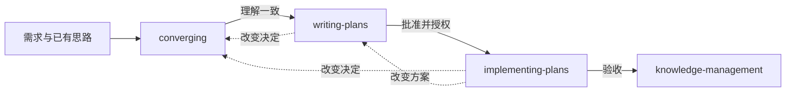

# 使用 Rivo

用户决定需求范围和重要取舍，AI 查清事实、提出建议，并按确认后的方案实施。文档留下决定的理由，供团队评审和后续修改。

## 什么时候走 Rivo

由用户决定：
- 用户要求用 Rivo、点名某个 Rivo 技能，或继续已有需求目录：进入对应技能
- 其他请求，即使项目里有 `.rivo/`，也按普通方式处理
- 遇到明显的中大型需求，可以建议走 Rivo，用户确认后再进入

单独点名一个技能时，完成它的范围就结束，不自动进入下一阶段。加载技能后先说明名称和本次要做什么，同一项工作中不重复。

## 一次交付

| 阶段 | 技能 | 做什么 | 结束于 |
| --- | --- | --- | --- |
| 讨论 | converging | 整理需求总览，按依赖调查和讨论，把重要取舍写成 ADR | 用户确认理解一致 |
| 方案 | writing-plans | 按模板写 plan.md，独立审阅，交用户和团队评审 | 用户批准方案 |
| 实施 | implementing-plans | 写粗粒度的 task.md，逐任务实施与审阅 | 用户验收 |
| 知识 | knowledge-management | 把核实过的机制和理由写进知识库，归档需求目录 | 知识更新、目录归档 |

```mermaid
flowchart LR
    U[需求与已有思路] --> C[converging]
    C -->|理解一致| P[writing-plans]
    P -->|批准并授权| I[implementing-plans]
    I -->|验收| K[knowledge-management]
    P -.改变决定.-> C
    I -.改变决定.-> C
    I -.改变方案.-> P
```

方法技能按需加载，完成后回到原任务：

| 技能 | 用途 |
| --- | --- |
| investigating | 查清技术事实，维护调查笔记 |
| writing-clearly | 所有文档的表达；阶段模板只管内容和结构 |
| test-driven-development | 用失败测试驱动行为实现 |
| systematic-debugging | 复现异常并验证根因 |

## 贯穿全程的约定

- **谁决定什么**：技术事实由 AI 查证；需求范围、业务行为和重要取舍由用户决定，也可以明确委托 AI；不改变这些约定的实现做法由 AI 选择并记录
- **批准与授权**：沉默不算批准。批准方案不等于授权实施，用户可以一次给出两者。已有的批准和授权沿用，不重复询问
- **外部操作**：推送、合并、发布需要相应授权，不从“完成需求”推导
- **发现问题**：先查事实，只暂停依赖这个问题的工作
- **核对进度**：继续工作时对照 ADR、plan.md、task.md、审阅报告和实际改动，不另设状态文件

各阶段技能按本阶段的含义写了这些约定的具体做法，以阶段技能为准。

## 产物

材料放在目标项目的 `.rivo/issues/<slug>/`，用户或项目指定的位置优先。

| 路径 | 内容 |
| --- | --- |
| `note.md` | 需求总览、调查结论、成文前暂存的做法 |
| `adr/` | 重要决定、理由及相互依赖 |
| `plan.md` | 技术方案，给人读、给人评审 |
| `task.md` | 粗粒度实施方案与实施记录 |
| `assets/` | 图、图源和方案附表 |
| `reviews/` | 审阅报告：`plan-<n>.md`、`<任务>.md`、`final-<n>.md` |
| `evidence/` | 验证证据 |

项目知识库默认在 `.rivo/knowledge/`，验收后的需求目录移入 `.rivo/archived/`。

## 宿主调用

| 动作 | Claude Code | Codex |
| --- | --- | --- |
| 加载技能 | 用 Skill 加载 `rivo:<技能名>` | 读取技能目录下的 SKILL.md |
| 向用户提问 | AskUserQuestion | 当前可用的提问工具 |
| 独立审阅与派发 | Agent 子代理 | spawn_agent 等子代理工具 |

- 模型分工、画图工具和开发环境按项目约定（AGENTS.md、CLAUDE.md），未指定时沿用宿主配置
- 子代理不可用时，继续不依赖审阅的工作，并报告审阅尚未完成。自查不算独立审阅
