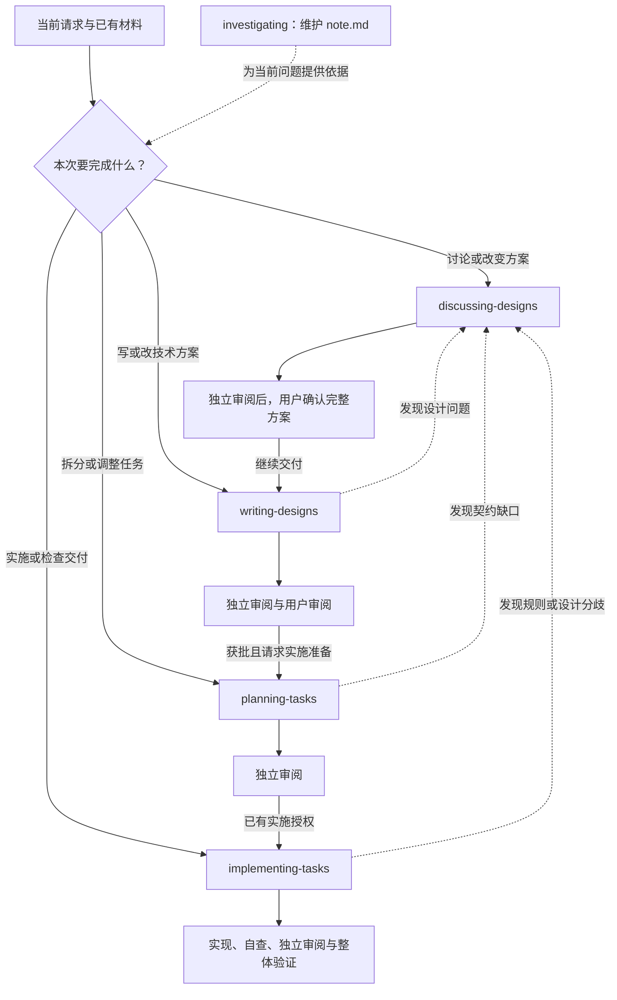

# Rivo 使用指南

用户主导目标和方向，AI 协助查证、讨论、表达与实施。根据用户当前要完成的工作选择技能，加载后声明名称和用途。入口不代替执行技能；解释代码、单点排障、单独改文档，都按指定范围处理。

## 选择技能

| 当前工作 | 加载技能 |
| --- | --- |
| 讨论新需求，或重新决定已有方案的做法 | discussing-designs |
| 将已确认方案写成文档，或处理方案评审意见 | writing-designs |
| 将获批方案拆成实施任务，或修改任务安排 | planning-tasks |
| 按约定实施、审阅、修复和验证 | implementing-tasks |
| 查清具体问题，维护专题调查笔记 | investigating |
| 比较并记录重要选择 | architecture-decisions |
| 绘制现状、目标、流程或状态图 | using-archify |
| 查找和维护跨需求的项目知识 | knowledge-management |
| 复现异常并验证根因 | systematic-debugging |
| 用失败测试驱动行为实现 | test-driven-development |

这些技能可以单独调用，也可以在工作中再次调用。先读相关过程文件、会话决定、审阅报告和实际改动，再确定本次入口；不因进入某个技能就重跑整个流程。

## 参考工作流

```mermaid
flowchart TD
    Request[当前请求与已有材料] --> Choose{本次要完成什么？}
    Choose -->|讨论或改变方案| Design[discussing-designs]
    Choose -->|写或改技术方案| Plan[writing-designs]
    Choose -->|拆分或调整任务| Tasks[planning-tasks]
    Choose -->|实施或检查交付| Delivery[implementing-tasks]
    Design --> Approved[独立审阅后，用户确认完整方案]
    Approved -->|继续交付| Plan
    Plan --> PlanReview[独立审阅与用户审阅]
    PlanReview -->|获批且请求实施准备| Tasks
    Tasks --> TaskReview[独立审阅]
    TaskReview -->|已有实施授权| Delivery
    Delivery --> Result[实现、自查、独立审阅与整体验证]
    Plan -.发现设计问题.-> Design
    Tasks -.发现契约缺口.-> Design
    Delivery -.发现规则或设计分歧.-> Design
    Investigate[investigating：维护 note.md] -.为当前问题提供依据.-> Choose
```

图示是一次完整交付的常见路径。采用 Rivo 交付时，方案与任务都要留档并审阅；需求简单就写短。各技能自己规定输入、批准、修订后复审和完成条件；只要求某项工作时，到该项结果为止。

`plan.md` 保存完整技术方案，`task.md` 保存实施任务，`note.md` 保存按主题组织的调查认识。重要选择保存到 `adr/`，审阅记录保存到 `reviews/`。默认不另写 Spec；已有 PRD、旧 Spec 和其他材料作为输入使用。

## 宿主调用

| 动作 | Claude Code | Codex |
| --- | --- | --- |
| 加载技能 | 用 Skill 加载含插件前缀的名称。 | 从技能目录读取 SKILL.md。 |
| 管理进度 | 使用 TaskCreate / TaskUpdate。 | 使用可用任务工具，没有时在会话列短清单。 |
| 收集决定 | 使用 AskUserQuestion。 | 使用当前可用的提问工具并遵守其模式限制。 |
| 独立审阅 | 使用 Agent / 子代理工具。 | 使用 spawn_agent 等子代理工具。 |

按实际技能列表和工具说明操作；工具需要发现时先查工具入口。技能通过技能目录加载，工具搜索无结果不能证明技能未安装。没有适用的提问工具时在会话中提问。

四个流程技能维护当前工作进度；调查、绘图、排障等方法技能交回结果，不另建嵌套进度。实际加载后才声明技能名称，切换技能时说明用途，同一工作中无需反复声明。

## 常见错误（Red Flags）

| 你在想 | 应当怎么做 |
| --- | --- |
| “入口已加载，可以直接做” | 加载真正负责当前工作的技能。 |
| “用了 Rivo，就必须从第一步重来” | 根据当前请求和已有材料选择入口。 |
| “文件存在，就能直接进入实施” | 在交付技能中核对当前审阅结果和实施授权。 |
| “方法技能也需要自己的进度清单” | 将方法结果交回当前工作。 |
| “任务小，可以省略文档或审阅” | 缩短文档，保留方案、任务与审阅。 |
