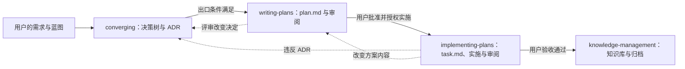

# Rivo 使用指南

**核心原则：** 软件交付由人类工程师主导。用户带着需求和脑中的方案蓝图开始，AI 查证、追问、补全并实施；重要的判断都在讨论中形成，避免把设计整体外包给 AI 而留下认知债务。

## 什么时候走 Rivo

由用户决定：
- 用户要求用 Rivo、点名某个 Rivo 技能，或继续已有需求目录：进入对应技能
- 其他请求，即使在 Rivo 项目里，也按普通方式处理
- 遇到明显的中大型需求，可以建议走 Rivo，用户确认后再进入

加载技能后先声明名称和用途。切换技能时说明原因，同一项工作中不重复声明。

## 一次交付

一次交付像一条河：几条支流汇成干流（讨论），勘定河道（方案），水顺着河道流下（实施），最后在入海口沉积成三角洲（知识）。

| 阶段 | 技能 | 做什么 |
| --- | --- | --- |
| 讨论 | converging | 从用户的蓝图出发逐轮提问，把定下的分叉写成 ADR |
| 方案 | writing-plans | 写技术方案 plan.md，独立审阅，交用户和团队评审 |
| 实施 | implementing-plans | 写粗粒度的 task.md，逐任务实施与审阅，请用户验收 |
| 知识 | knowledge-management | 验收后整理进项目知识库，归档需求目录；也用于查阅和整理项目知识 |

```mermaid
flowchart LR
    User[用户的需求与蓝图] --> C[converging：决策树与 ADR]
    C -->|出口条件满足| P[writing-plans：plan.md 与审阅]
    P -->|用户批准并授权实施| F[implementing-plans：task.md、实施与审阅]
    F -->|用户验收通过| D[knowledge-management：知识库与归档]
    P -.评审改变决定.-> C
    F -.违反 ADR.-> C
    F -.改变方案内容.-> P
```

回退有明确条件：
- 评审意见或实施改变了某份 ADR 的决定：回到 converging
- 实施只改变方案内容：回到 writing-plans

方法技能随时可以加载，结果交回当前的流程技能：

| 技能 | 用途 |
| --- | --- |
| investigating | 查清具体问题，维护调查笔记 note.md |
| writing-clearly | 写清楚文档、图和提示词，去掉 AI 腔 |
| test-driven-development | 用失败测试驱动行为实现 |
| systematic-debugging | 复现异常并验证根因 |

## 贯穿全程的约定

**用户做决定：**
- 沉默、跳过或关闭提问都不算批准
- 批准方案不等于授权实施
- 已有的批准和授权不重复索取

**讨论：** 讨论是一棵决策树，每个定下的分叉当场写成 ADR；满足出口条件才结束，不靠审阅来补漏。

**独立审阅：**
- 子代理只用在四处：审阅方案、实施、审阅实施、调查
- 方案在第一次定稿前全量审一次；实施逐任务轻审一轮，完成后全量整体审阅
- 审阅者只观测，不替用户做决定
- 问题分 P0、P1、P2，没有 P0 即通过；可以带着 P2 上线
- 只收实质问题，不收措辞偏好
- 修复后交同一审阅者增量复核，能续用会话就续用

**方案变更：** 任何对 plan.md 的修改都告诉用户改了什么、为什么。

**实施：** 实施是对方案的验证，执行者发现方案走不通就停下报告。

**收尾：** 用户明确验收之后才更新知识库和归档。

**修订：** 修订后的文本只陈述当前的做法，读起来像第一次就写对了。

**进度：** 不维护状态文件，从 ADR、plan.md、task.md、审阅报告和实际改动中核对。

## 产物

材料集中在目标项目的 `.rivo/issues/<slug>/`，用户或项目指定的位置优先：

| 路径 | 内容 |
| --- | --- |
| `adr/` | 决策树的每个分叉 |
| `plan.md` | 技术方案，给人读、给人评审 |
| `task.md` | 粗粒度实施方案与实施记录 |
| `note.md` | 按主题组织的调查笔记 |
| `assets/` | 图源与 SVG |
| `reviews/` | 每轮审阅报告：`plan-<n>.md`、`<任务>.md`、`final-<n>.md` |
| `evidence/` | 验证证据 |

- 项目知识库默认在 `.rivo/knowledge/`
- 验收后的需求目录移入 `.rivo/archived/`
- 继续已有需求目录时，先读这些材料，从当前阶段接着做

## 宿主调用

| 动作 | Claude Code | Codex |
| --- | --- | --- |
| 加载技能 | 用 Skill 加载含插件前缀的名称，例如 `rivo:converging` | 从技能目录读取 SKILL.md |
| 管理进度 | TaskCreate / TaskUpdate | 可用的任务工具，没有时在会话中列短清单 |
| 向用户提问 | AskUserQuestion | 当前可用的提问工具 |
| 独立审阅与派发 | Agent 子代理 | spawn_agent 等子代理工具 |

- 技能从技能目录加载，工具搜索找不到不能说明技能未安装
- 流程技能维护当前工作的进度，方法技能不另建进度
- 子代理的模型沿用宿主配置，Rivo 不指定
