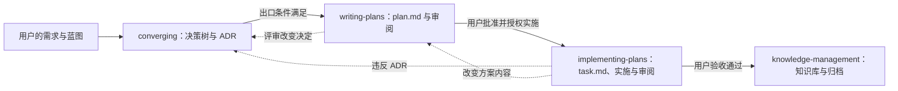

# Rivo 使用指南

Rivo 让一次软件交付由人类工程师主导：用户带着需求和脑中的方案蓝图开始，AI 查证、追问、补全并实施，重要的判断都在讨论中形成，避免把设计整体外包给 AI 而留下认知债务。

## 什么时候走 Rivo

是否走 Rivo 由用户决定。用户要求用 Rivo 完成一项需求、点名某个 Rivo 技能，或继续一个已有的需求目录时，进入对应的技能；其他请求，即使发生在 Rivo 项目里，也按普通方式直接处理。遇到明显的中大型需求，可以建议走 Rivo，用户确认后再进入。

加载技能后先声明它的名称和用途。切换技能时说明原因，同一项工作中不重复声明。

## 一条河

一次交付像一条河。几条支流汇成干流，勘定河道，水顺着河道流下，最后在入海口沉积成三角洲。

| 阶段 | 技能 | 做什么 |
| --- | --- | --- |
| 汇流 | converging | 从用户的蓝图出发，逐轮提问，每轮收轮时把定下的分叉写成 ADR，满足出口条件后结束 |
| 河道 | writing-plans | 把讨论沉淀为技术方案 plan.md，送审前自查，全量独立审阅，交用户和团队评审 |
| 水流 | implementing-plans | 写粗粒度的实施方案 task.md，逐任务派发与审阅，实施即验证方案，整体审阅后请用户验收 |
| 三角洲 | knowledge-management | 用户验收后，把本次认识整理进项目知识库，归档需求目录；也用于查阅项目知识、整理单独调查的笔记，或按用户指定重写已有知识库 |

沿途还有三样东西。独立审阅是水文站：只观测、不改变河流，审阅者不替用户做决定。任务分段是船闸：前一级通过，才开下一道。河道不对时逆流而上：评审意见或实施改变了某份 ADR 的决定，就回到 converging；实施只改变方案内容，就回到 writing-plans。回退都有明确条件。

方法技能随时可以被加载，结果交回当前的流程技能：

| 技能 | 用途 |
| --- | --- |
| investigating | 查清具体问题，维护调查笔记 note.md |
| drawing-diagrams | 画 before/after 图，嵌入 Markdown 的 SVG |
| test-driven-development | 用失败测试驱动行为实现 |
| systematic-debugging | 复现异常并验证根因 |

```mermaid
flowchart LR
    User[用户的需求与蓝图] --> C[converging：决策树与 ADR]
    C -->|出口条件满足| P[writing-plans：plan.md 与审阅]
    P -->|用户批准并授权实施| F[implementing-plans：task.md、实施与审阅]
    F -->|用户验收通过| D[knowledge-management：知识库与归档]
    P -.评审改变决定.-> C
    F -.违反 ADR.-> C
    F -.改变方案内容.-> P
```

## 贯穿全程的约定

- 用户主导方向和决定。沉默、跳过或关闭提问都不算批准；批准方案不等于授权实施；已有的批准和授权不重复索取。
- 讨论是一棵决策树，每个定下的分叉当场写成 ADR；讨论要满足出口条件才结束，不靠审阅来补漏。
- 独立审阅每一轮都看完整对象，问题分阻塞和非阻塞；只剩非阻塞问题即通过，改完直接推进；同一对象三轮未通过就停下分析根因，报给用户。
- 任何对 plan.md 的修改都告诉用户改了什么、为什么改。
- 实施是对方案的验证，执行者发现方案走不通就停下报告。
- 用户明确验收之后才收尾：知识库由 knowledge-management 在验收后维护，没有验收就不归档。
- 修订后的文本只陈述当前的做法，读起来像第一次就写对了。
- 不维护状态文件。进度从 ADR、plan.md、task.md、审阅报告和实际改动中核对。

## 产物

材料集中在目标项目的 `.rivo/issues/<slug>/`，用户或项目指定的位置优先：

| 路径 | 内容 |
| --- | --- |
| `adr/` | 决策树的每个分叉 |
| `plan.md` | 技术方案，给人读、给人评审 |
| `task.md` | 粗粒度实施方案与实施记录 |
| `note.md` | 按主题组织的调查笔记 |
| `assets/` | 图源、SVG 与交付回执 |
| `reviews/` | 每轮审阅报告：`plan-<n>.md`、`<任务>-<n>.md`、`final-<n>.md` |
| `evidence/` | 验证证据 |

项目知识库默认在 `.rivo/knowledge/`，验收后的需求目录移入 `.rivo/archived/`。继续一个已有需求目录时，先读这些材料，从当前所处的阶段接着做，不从头重来。

## 宿主调用

| 动作 | Claude Code | Codex |
| --- | --- | --- |
| 加载技能 | 用 Skill 加载含插件前缀的名称，例如 `rivo:converging` | 从技能目录读取 SKILL.md |
| 管理进度 | TaskCreate / TaskUpdate | 可用的任务工具，没有时在会话中列短清单 |
| 向用户提问 | AskUserQuestion | 当前可用的提问工具 |
| 独立审阅与派发 | Agent 子代理 | spawn_agent 等子代理工具 |

技能从技能目录加载，工具搜索找不到不能说明技能未安装。流程技能维护当前工作的进度，方法技能不另建进度。
