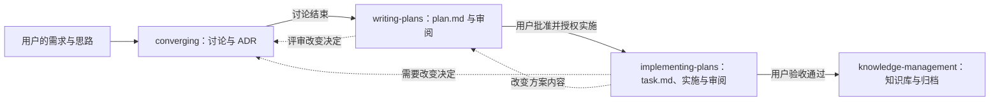

# Rivo 使用指南

用户决定需求范围和重要取舍，AI 调查事实、提出建议，并按确认后的方案实施。文档保留决定的理由，方便团队评审和后续修改。

## 什么时候走 Rivo

由用户决定：
- 用户要求用 Rivo、点名某个 Rivo 技能，或继续已有需求目录：进入对应技能
- 其他请求，即使在 Rivo 项目里，也按普通方式处理
- 遇到明显的中大型需求，可以建议走 Rivo，用户确认后再进入

加载技能后先声明名称和用途。切换技能时说明原因，同一项工作中不重复声明。

## 一次交付

一次交付分为讨论、方案、实施和知识整理四个阶段。评审或实施发现原决定不成立时，回到相应阶段处理。

| 阶段 | 技能 | 做什么 |
| --- | --- | --- |
| 讨论 | converging | 从用户的思路出发逐轮讨论，把重要取舍写成 ADR |
| 方案 | writing-plans | 写技术方案 plan.md，独立审阅，交用户和团队评审 |
| 实施 | implementing-plans | 写粗粒度的 task.md，逐任务实施与审阅，请用户验收 |
| 知识 | knowledge-management | 验收后整理进项目知识库，归档需求目录；也用于查阅和整理项目知识 |

```mermaid
flowchart LR
    User[用户的需求与思路] --> C[converging：讨论与 ADR]
    C -->|讨论结束| P[writing-plans：plan.md 与审阅]
    P -->|用户批准并授权实施| F[implementing-plans：task.md、实施与审阅]
    F -->|用户验收通过| D[knowledge-management：知识库与归档]
    P -.评审改变决定.-> C
    F -.需要改变决定.-> C
    F -.改变方案内容.-> P
```

回退有明确条件：
- 评审意见或实施改变了某份 ADR 的决定：回到 converging
- 实施只改变方案内容：回到 writing-plans

讨论、编写方案或实施时，可以按需要加载以下方法技能。完成后继续原任务：

| 技能 | 用途 |
| --- | --- |
| investigating | 查清具体问题，维护调查笔记 note.md |
| writing-clearly | 写清楚文档、图和提示词，去掉 AI 腔 |
| test-driven-development | 用失败测试驱动行为实现 |
| systematic-debugging | 复现异常并验证根因 |

## 贯穿全程的约定

沉默、跳过或关闭提问不算批准；批准方案不等于授权实施。已有的批准和授权沿用，不重复询问。

讨论期间，重要取舍写成 ADR（架构决策记录），普通细节暂记 note.md，成文时一并纳入方案。任何对 plan.md 的修改都告诉用户改了什么、为什么。正文说明当前做法，修改过程留在修订记录中。

子代理用于方案审阅、实施、实施审阅和调查。方案首次定稿前全量审阅一次；实施逐任务轻审，全部完成后整体审阅。审阅者检查事实和影响，不替用户做决定，不把措辞偏好当作缺陷。

审阅问题按以下标准处理，各审阅提示词给出对应场景的具体定义：

| 级别 | 处理 |
| --- | --- |
| P0：导致做错、遗漏需求或缺少必要验证 | 必须修复，没有 P0 才能通过审阅 |
| P1：行为正确，但影响质量 | 默认修复；代价明显高于收益时可保留，写明理由 |
| P2：不影响理解和执行的轻微瑕疵 | 可保留，顺手能改的改 |

修复交给同一审阅者检查改动及其影响，宿主支持时续用原会话。未修问题在交付时列给用户。

实施发现方案走不通时，报告证据和影响，按 implementing-plans 处理。需求交付经用户明确验收后，再更新知识库并归档；单独查阅或整理知识按 knowledge-management 的相应入口处理。

继续工作时，对照 ADR、plan.md、task.md、审阅报告和实际改动核对进度，不另设状态文件。

## 产物

材料集中在目标项目的 `.rivo/issues/<slug>/`，用户或项目指定的位置优先：

| 路径 | 内容 |
| --- | --- |
| `adr/` | 重要决定、理由及相互依赖 |
| `plan.md` | 技术方案，给人读、给人评审 |
| `task.md` | 粗粒度实施方案与实施记录 |
| `note.md` | 调查笔记，成文前暂存已确认的方案细节 |
| `assets/` | 图源与 SVG |
| `reviews/` | 每轮审阅报告：`plan-<n>.md`、`<任务>.md`、`final-<n>.md` |
| `evidence/` | 验证证据 |

- 项目知识库默认在 `.rivo/knowledge/`
- 验收后的需求目录移入 `.rivo/archived/`

## 宿主调用

| 动作 | Claude Code | Codex |
| --- | --- | --- |
| 加载技能 | 用 Skill 加载含插件前缀的名称，例如 `rivo:converging` | 从技能目录读取 SKILL.md |
| 管理进度 | TaskCreate / TaskUpdate | 可用的任务工具，没有时在会话中列短清单 |
| 向用户提问 | AskUserQuestion | 当前可用的提问工具 |
| 独立审阅与派发 | Agent 子代理 | spawn_agent 等子代理工具 |

- 技能从技能目录加载，工具搜索找不到不能说明技能未安装
- 流程技能维护当前工作的进度，方法技能不另建进度
- 子代理的模型沿用宿主配置，Rivo 不指定
