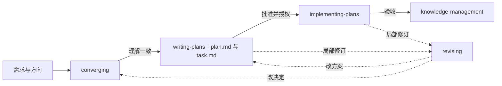

# 使用 Rivo

用户决定方向和重要取舍，AI 查清事实、提出建议，并按确认后的方案实施。文档保留决定的理由，供团队评审和后续修改。

## 什么时候走 Rivo

由用户决定：
- 用户要求用 Rivo、点名某个 Rivo 技能，或继续已有需求目录：进入对应技能
- 其他请求，即使项目里有 `.rivo/`，也按普通方式处理
- 遇到明显的中大型需求，可以建议走 Rivo，用户确认后再进入

交付阶段按下表顺序衔接，进入下一阶段前需满足相应的确认与授权条件；只有方法技能支持脱离交付流程独立使用，完成当前请求就结束。进入某个技能时，用一句话说明当前阶段和本次要做什么，同一项工作中不重复。

## 一次交付

| 阶段 | 技能 | 做什么 | 结束于 |
| --- | --- | --- | --- |
| 讨论 | converging | 先问用户是否已有方向，查清现状与组件映射，按决策树讨论并记录决定 | 用户确认理解一致 |
| 方案 | writing-plans | 写技术方案 `plan.md` 并独立审阅；用户批准后，在同一会话内拆出 `task.md` | 方案批准且 `task.md` 就绪 |
| 实施 | implementing-plans | 按任务实施、自测与独立审阅，收尾时对照项目约定核对发布准备 | 用户验收 |
| 知识 | knowledge-management | 把核实过的机制和理由合进知识库 Wiki，归档需求目录 | 知识更新、目录归档 |

```mermaid
flowchart LR
    U[需求与方向] --> C[converging]
    C -->|理解一致| P[writing-plans：plan.md 与 task.md]
    P -->|批准并授权| I[implementing-plans]
    I -->|验收| K[knowledge-management]
    P -.局部修订.-> R[revising]
    I -.局部修订.-> R
    R -.改决定.-> C
    R -.改方案.-> P
```

已确认的决定、技术方案或实施方案需要局部修改时，加载 `revising` 从受影响的最上游一层逐层改到代码。如果实施到中后期发现底层模型要推翻重做，先收尾或冻结当前需求，另开独立的重构需求。

方法技能按需加载，完成后回到原任务：

| 技能 | 用途 |
| --- | --- |
| investigating | 查清技术事实与设计稿组件映射，维护调查笔记 |
| dispatching-subagents | 安排独立调查、独立审阅或样板定型后的批量委派 |
| test-driven-development | 用失败测试驱动行为实现 |
| systematic-debugging | 复现异常并验证根因 |

## 贯穿全程的约定

- **谁决定什么**：代码和配置能查明的事实由 AI 自己查，不拿去问用户。设计方案前，先询问用户是否已有方向思路；用户没有时才由 AI 先拟方案再一起讨论。范围和重要取舍由用户决定，任务内的局部代码写法由执行者选择并记录
- **批准与授权**：沉默不算批准。批准方案不等于授权实施，用户可以一次给出两者。推送、合并、发布或线上操作需要相应授权，不从“完成需求”推导
- **分次实施与接力**：小需求可以在一个会话里做完；任务较多时，在 `plan.md` 和 `task.md` 定稿后，可以按任务分次开启新会话推进，靠 `task.md` 中记录的样板位置、实测结论和已提交的代码接力，不硬撑超长会话，也不另设状态文件
- **遵守项目规约**：编码规范、组件库、写作偏好和画图工具按目标项目的 `AGENTS.md`、`CLAUDE.md` 及当前环境可用工具执行。缺少子代理工具时，继续不依赖委派的工作并如实说明缺口，不把主会话自查算作独立审阅

## 产物与目录

材料默认放在目标项目的 `.rivo/issues/<slug>/`，用户或项目指定的位置优先。需求根目录只放下列入口文件，不把临时对比、自查汇总或一次性脚本留在根目录：

| 路径 | 内容 | 谁写 |
| --- | --- | --- |
| `decisions.md` | 范围、全部决定、待决事项 | converging |
| `adr/` | 重要取舍及理由 | converging |
| `research/` | 按主题维护的调查笔记 | investigating |
| `plan.md`、`assets/` | 技术方案及其附件，给人读、给人评审 | writing-plans |
| `task.md` | 实施方案、复用锚点与每项任务的实测记录 | writing-plans / implementing-plans |
| `evidence/` | 验证证据、日志、截图与一次性排障记录 | implementing-plans / investigating |
| `reviews/` | 审阅报告：`plan-<n>.md`、`<任务>.md`、`final-<n>.md` | 各阶段的审阅者 |

一类产物只有一个位置。现状写进 `research/`，决定和理由写进 `decisions.md` 与 `adr/`，架构与边界写进 `plan.md`，任务拆分和实测踩坑写进 `task.md`，互不搬运。

项目知识库默认在 `.rivo/knowledge/`（按系统域维护的 Wiki），验收后的需求目录移入 `.rivo/archived/`。
